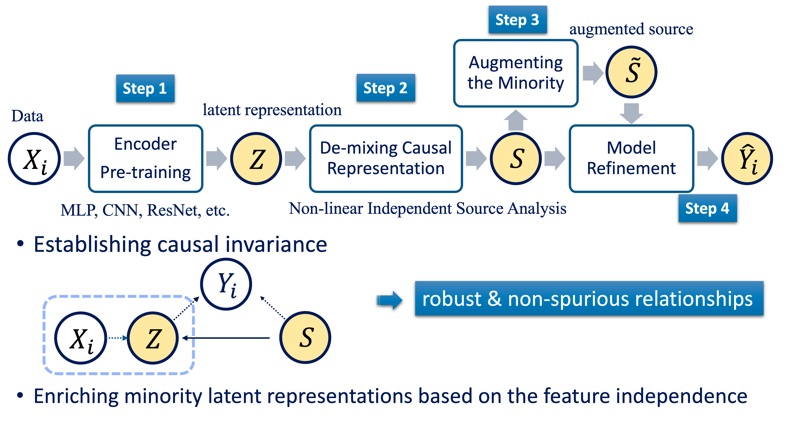

# ECRT: Energy-based Causal Representation Transfer

Code for Supercharging Imbalanced Data Learning With Energy-basedContrastive Representation Transfer (NeurIPS 2021)

<a href="pdf/NeurIPS-2021-supercharging-imbalanced-data-learning-with-energy-based-contrastive-representation-transfer-Paper.pdf" class="image fit"></a>

## Model

### Prerequisites

The algorithm is built with:

* Python (version 3.7 or higher)
* Numpy (version 1.16 or higher)
* PyTorch (version 1.3.1)

Clone the repository, e.g.:
```
git clone https://github.com/ZidiXiu/ECRT.git
```


### Running the Toy Dataset

Here we present a toy synthetic dataset 

```
python train train_CRT_toy.py
```

When building the CRT framework, we referenced the following sources: 
* [MADE flow](https://github.com/kamenbliznashki/normalizing_flows/blob/master/maf.py)
* [GCL learning](https://github.com/takeshi-teshima/few-shot-domain-adaptation-by-causal-mechanism-transfer)

